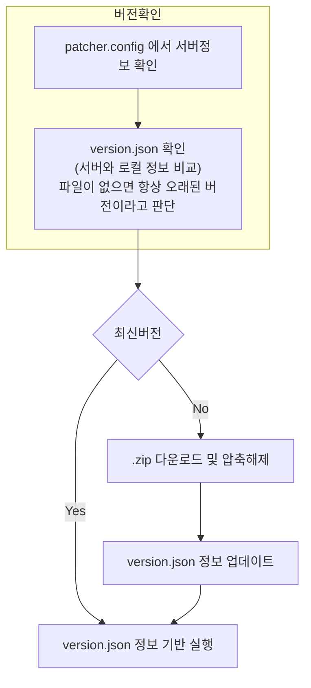
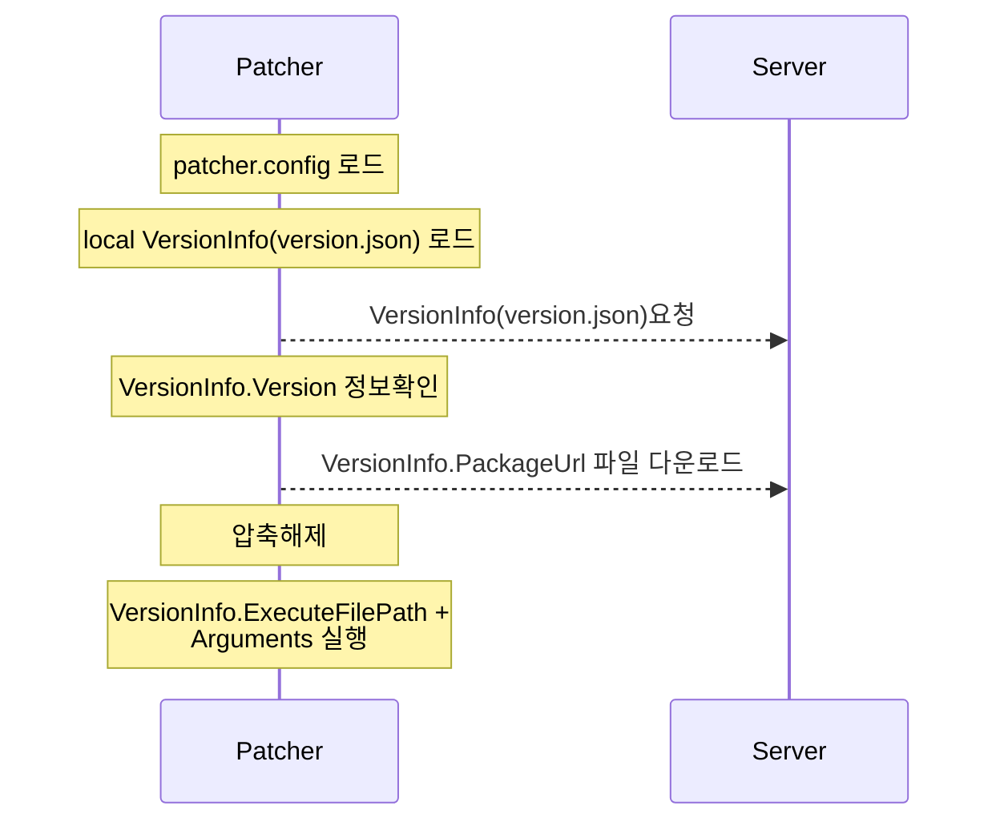

# patcher
windows application updater

## 사용방법

1. 배포될 application pacakge(patcher 를 제외)를 하나의 압축파일(`.zip`)로 압축해둔다. (예 - `SamplePacakge.zip`)

2. 웹서버를 준비하고 위 package 파일에 접근(다운로드)할 수 있도록 설정한다. (예 - `https://host.sample/downlaod/SamplePackage.zip` )

3. 마찬가지로 웹에서 다운로드 가능한
[버전 정보파일](https://github.com/alkee/patcher/blob/748d5b32bdedcc03d1cd32eeefd5541b6a19af7d/Patcher/AppConfig.cs#L36)
(아래 참고)을 준비한다. (예 - `https://host.sample/downlaod/version.json`)

```json
{
	"Version": "1.0.0.1",
	"PackageUrl": "https://host.sample/downlaod/SamplePackage.zip",
	"ExecuteFilePath": "sample.exe",
        "Arguments": "sample args"
}
```

4. 실행파일과 같은이름으로 [설정 파일(AppConfig)](https://github.com/alkee/patcher/blob/748d5b32bdedcc03d1cd32eeefd5541b6a19af7d/Patcher/AppConfig.cs#L7)
을 준비 (예 - `patcher.config`)

```json
{
	"VersionJsonUrl": "https://host.sample/download/version.json",
	"Title": "Title of the patcher"
}
```

5. 패치 실행파일(`patcher.exe`)과 설정파일(`patcher.config`)을 같은 경로에 두고 실행한다.


## 추가 정보

### 동작 flow



### patch 과정


